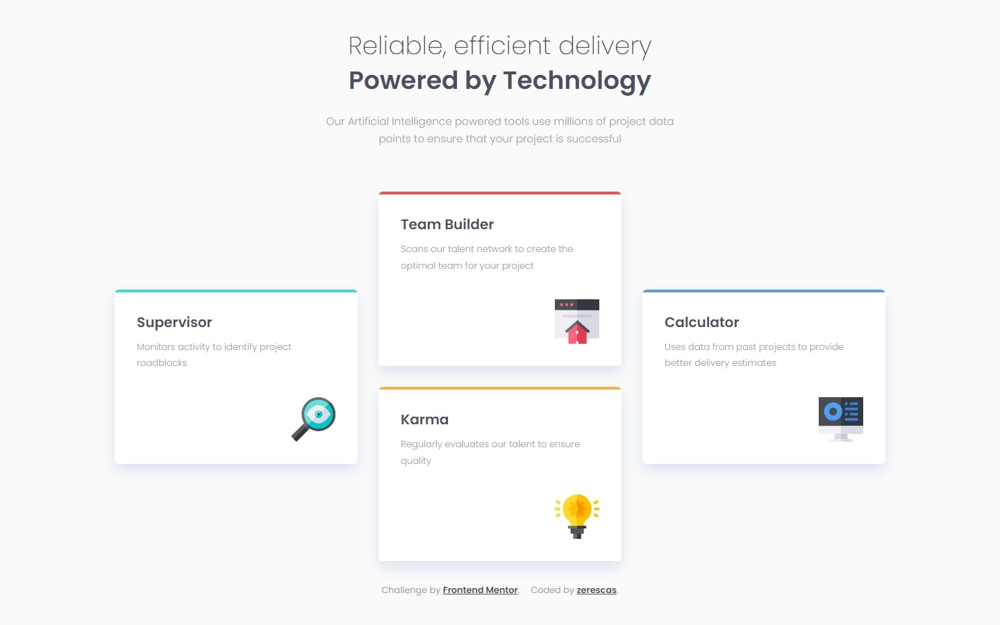
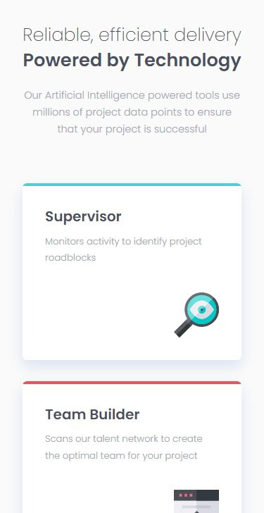
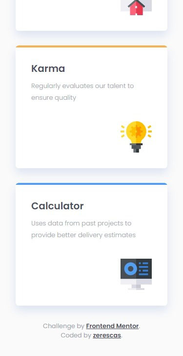

# Frontend Mentor - Four card feature section solution

This is a solution to the [Four card feature section challenge on Frontend Mentor](https://www.frontendmentor.io/challenges/four-card-feature-section-weK1eFYK). Frontend Mentor challenges help you improve your coding skills by building realistic projects. 

## Table of contents

- [Overview](#overview)
    - [The Challenge](#the-challenge)
    - [Screenshots](#the-challenge)
    - [Links](#links)
- [My process](#my-process)
    - [Built with](#built-with)
    - [What I learned](#what-i-learned)
- [Author](#author)

## Overview

### The challenge

Users should be able to:

- View the optimal layout for the site depending on their device's screen size

### Screenshots

 
 
<strong>Desktop</strong>

 

 
<strong>Mobile</strong>

### Links

- Live Site URL: [...](...)

## My process

### Built with

- Semantic HTML5 markup
- CSS custom properties and flexbox

### What I learned

Improve my HTML / CSS knowledges.

## Author

- Twitter - [https://twitter.com/zerescas](https://twitter.com/zerescas)
- Telegram - [https://t.me/zerescas](https://t.me/zerescas)
